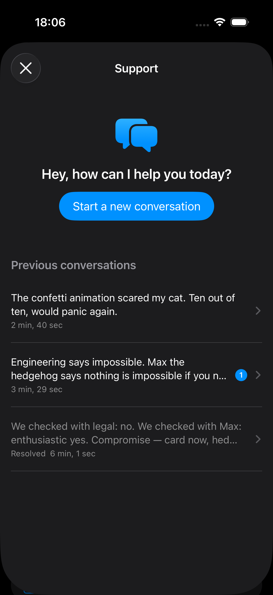
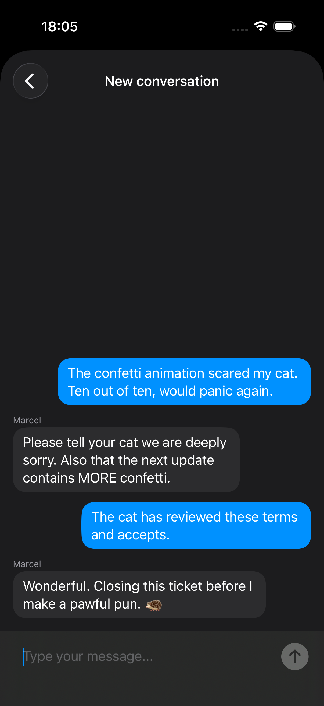
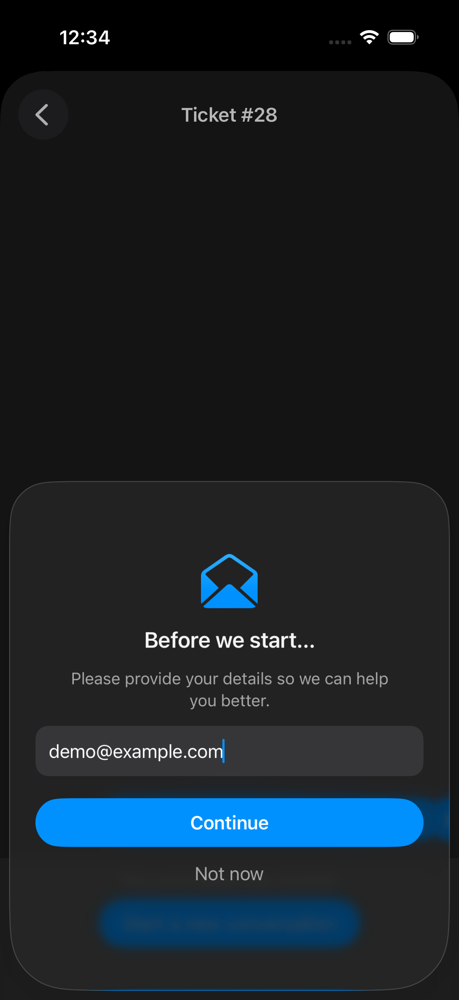

# posthog-ios-support-chat

[](https://github.com/hoppsen/posthog-ios-support-chat/actions/workflows/building.yml)
[](https://github.com/hoppsen/posthog-ios-support-chat/actions/workflows/testing.yml)
[](https://github.com/hoppsen/posthog-ios-support-chat/actions/workflows/linting.yml)


[](LICENSE)

Native iOS support chat built on [PostHog Support (Conversations)](https://posthog.com/docs/support/widget) — the same backend and client protocol as PostHog's web support widget, with a SwiftUI chat UI. Tickets land in your PostHog inbox with person profiles, session context, and analytics attached. No extra SaaS, no custom backend.

> **Unofficial.** This is a community package, not maintained by PostHog. It speaks the client-side widget protocol used by posthog-js (`/api/conversations/v1/widget/*`), which is beta and may change. When official mobile Conversations support lands in [posthog-ios](https://github.com/PostHog/posthog-ios) (tracked in [PostHog/posthog#56771](https://github.com/PostHog/posthog/issues/56771)), the transport layer here can be swapped out while keeping the UI.

<p align="center">
  
  &nbsp;
  
  &nbsp;
  
</p>

## Requirements

- iOS 17+
- PostHog project with **Support enabled** (Settings → Support). The web widget toggle can stay off; only the API needs to be enabled.

## Products

| Product | What it is |
|---|---|
| `PostHogSupportChat` | SwiftUI chat UI (`SupportChatView`) + everything below |
| `PostHogSupportChatClient` | Transport only: API client, models, Keychain session store — bring your own UI |

## Usage

```swift
import PostHogSupportChat
import PostHogSupportChatClient

// Bridge your PostHog SDK state (avoids a hard dependency on posthog-ios):
struct PostHogContext: SupportChatContextProvider {
    var distinctId: String { PostHogSDK.shared.getDistinctId() }
    var sessionId: String? { PostHogSDK.shared.getSessionId() }
}

let supportChat = SupportChatClient(
    configuration: .init(
        projectApiKey: "phc_...",
        host: .us,
        // Recommended: your website's origin. Required for sending messages
        // if your Support settings restrict allowed domains; harmless otherwise.
        origin: URL(string: "https://example.com")
    ),
    context: PostHogContext()
)

// Present the chat:
.sheet(isPresented: $showSupport) {
    SupportChatView(client: supportChat)
}
```

Refresh the unread badge on app foreground:

```swift
try? await supportChat.refreshTickets()   // supportChat.unreadCount
```

### Copy and localization

Every user-facing string resolves in this order:

```
strings: parameter (your app)  →  the package's translations (54 languages)
```

Copy configured in the PostHog dashboard is skipped unless you opt in, in which case it slots in between:

```
strings: parameter  →  PostHog dashboard  →  the package's translations
```

That default is deliberate. Enabling Support pre-fills the dashboard fields with English defaults (`Hey, how can I help you today?`, `Type your message...`, …), and **PostHog stores no translations for them** — unlike surveys. Using them would show English to every user regardless of locale, in place of the translations this package exists to provide. Left alone, those fields stay free to configure a web widget independently.

Override only what you want to word yourself:

```swift
SupportChatView(
    client: supportChat,
    strings: .init(
        greeting: LocalizedStringResource("Hi! How can we help?", comment: "Support chat greeting"),
        placeholder: LocalizedStringResource("Type your message…", comment: "Support chat input"),
        identificationTitle: LocalizedStringResource("Before we start…", comment: "Support email form title"),
        identificationDescription: LocalizedStringResource("Add your email so we can get back to you.",
                                                           comment: "Support email form description")
    )
)
```

`LocalizedStringResource` resolves at display time, so these follow an in-app language switcher; in an app they default to the main bundle, so Xcode extraction and existing translation tooling pick them up.

### Using the dashboard copy instead

```swift
SupportChatConfiguration(projectApiKey: "phc_...", usesDashboardStrings: true)
```

Worth it for a single-language app that wants to reword the greeting without shipping a release, or to keep an iOS chat and a web widget identical. The trade is the one above: whatever is typed in the dashboard is what every user sees, in that one language. Anything you pass in `strings:` still wins, and the bundled translations still fill fields the dashboard leaves empty.

### Tint

The chat draws itself in the environment tint, so it picks up your app's accent with no configuration — and you can override it per presentation:

```swift
SupportChatView(client: supportChat)
    .tint(.brandGreen)
```

One caveat if you present the chat in its own `UIWindow` (see below): a new window starts a fresh SwiftUI environment, so a `.tint(…)` applied to your app's root view does **not** reach it. It falls back to the `AccentColor` asset, which is the system blue if you set your accent programmatically instead. Apply `.tint(…)` to the `SupportChatView` you put in the window.

### Mirroring chat activity into your analytics

PostHog captures an internal `$conversation_ticket_created` event server-side, but it is **personless** — workflows keyed on it cannot use person properties. The client's `onEvent` hook lets your app capture its own events with full person processing, which is the right trigger for person-based workflows (e.g. "notify me with the customer's context when a ticket is created"):

```swift
supportChat.onEvent = { event in
    switch event {
    case let .messageSent(ticketId, isNewTicket):
        PostHogSDK.shared.capture("support:chat_message_sent",
                                  properties: ["ticket_id": ticketId, "is_new_ticket": isNewTicket])
    case let .identificationSubmitted(email, name):
        // `email` and `name` (unprefixed) are the properties PostHog uses to
        // display a person, so writing them turns UUIDs into readable names
        // across persons, activity, and the support inbox. This sets
        // properties on the existing person — it does not identify or merge
        // anyone, and the address is unverified, so treat it as a label.
        var person: [String: Any] = [:]
        if let email { person["email"] = email }
        if let name { person["name"] = name }
        PostHogSDK.shared.capture("support:chat_identification_submit",
                                  userProperties: person)
    }
}
```

### Feedback entry point (e.g. a Home Screen quick action)

For entry points that should always reach users — like a "Send Feedback" quick action shown when someone long-presses your app icon — present the chat in its own `UIWindow` so it appears above everything, including full-screen covers a SwiftUI sheet cannot present over:

```swift
@MainActor private var overlayWindow: UIWindow?

@MainActor
func presentFeedbackChat(in scene: UIWindowScene) {
    guard overlayWindow == nil else { return }
    supportChat.additionalTraits = ["source": "quick_action"]  // shows up on the ticket in your inbox

    let window = UIWindow(windowScene: scene)
    window.windowLevel = .alert
    window.rootViewController = UIViewController()
    window.makeKeyAndVisible()

    let chat = SupportChatView(
        client: supportChat,
        startNewConversation: true,   // straight into a fresh conversation
        strings: .init(greeting: LocalizedStringResource("We read every message. What can we do better?",
                                                         comment: "Support chat greeting for the feedback action"))
    )
    .tint(.brandGreen)   // a new window does not inherit the app's environment tint

    let host = DismissReportingHostingController(rootView: chat)
    host.onDismiss = { dismissOverlay() }
    overlayWindow = window

    // Defer one runloop: presenting synchronously during scene activation can
    // be silently dropped (e.g. while a system alert holds key after launch).
    DispatchQueue.main.async {
        window.rootViewController?.present(host, animated: true)
        // Self-heal if the presentation was dropped anyway, so the next
        // attempt is not swallowed by the singleton guard above.
        DispatchQueue.main.asyncAfter(deadline: .now() + 1.5) {
            if host.presentingViewController == nil { dismissOverlay() }
        }
    }
}

@MainActor
func dismissOverlay() {
    overlayWindow?.isHidden = true
    overlayWindow = nil
}

/// Reports dismissal (close button or swipe) so the window can be torn down.
private final class DismissReportingHostingController<Content: View>: UIHostingController<Content> {
    var onDismiss: (() -> Void)?

    override func viewDidDisappear(_ animated: Bool) {
        super.viewDidDisappear(animated)
        if isBeingDismissed { onDismiss?() }
    }
}
```

## How it works

- **Auth:** the public conversations token is fetched from PostHog's remote config (`/array/<projectApiKey>/config` → `conversations.token`) and sent as `X-Conversations-Token`. No secret keys on device.
- **Allowed domains:** if your project's Support settings restrict allowed domains, pass one of them as `origin` in the configuration — write endpoints reject native requests without an allowlisted `Origin` header. With an empty domain list, leave it nil.
- **Access control:** a client-generated `widget_session_id` (stored in the **Keychain**, so ticket history survives app reinstalls) scopes all ticket access; wrong ids get 403.
- **Identity:** designed for anonymous users. The identification form asks for whatever the project collects — an email, a name, or both — once per session before the first message; declining is allowed and remembered for the session. What is provided is sent as a message trait: it labels tickets in your inbox and, for an email, enables PostHog's reply notifications. Nothing is verified and nothing is merged: ticket access stays keyed to the Keychain-stored session id, so two people who type the same address remain separate, and neither can reach the other's conversations.
- **New messages:** sent messages are echoed locally from the send response; incoming replies arrive via polling while the conversation is on screen (2s default, configurable via `pollInterval`), plus refresh on demand. No push — use PostHog's email notifications for async replies until [Workflows push notifications](https://github.com/PostHog/posthog/issues/45009) ship for iOS.
- **Device moves:** not covered — the Keychain-stored session survives reinstalls on the same device, which is the common case for anonymous users. PostHog's email-based ticket recovery is currently web-oriented; see `CLAUDE.md` for the verified protocol details if you want to build on it.

## Endpoint map (verified against the live API)

All under the ingestion host (`https://us.i.posthog.com` / `eu.i.posthog.com`), header `X-Conversations-Token`:

| Endpoint | Purpose |
|---|---|
| `POST /api/conversations/v1/widget/message` | Send message; `ticket_id: null` creates a ticket |
| `GET /api/conversations/v1/widget/messages/{id}?after=` | Fetch messages, incremental via `after` cursor |
| `POST /api/conversations/v1/widget/messages/{id}/read` | Mark read |
| `GET /api/conversations/v1/widget/tickets` | Ticket list with unread counts |

Messages carry rich text as TipTap JSON (`rich_content`), rendered to `AttributedString` by `TipTapRenderer`. Replies sent from the PostHog inbox arrive as markdown in `content` instead, which the same renderer parses, falling back to plain text.

## Development

Tooling mirrors our app repos: [Mint](https://github.com/yonaskolb/Mint)-pinned SwiftFormat + SwiftLint, fastlane lanes, a pre-commit hook, and GitHub Actions for linting, tests, and a Release build for a generic iOS device.

```bash
bundle install
bundle exec fastlane setup    # installs the pre-commit hook (lint + format on staged files)
bundle exec fastlane lint     # SwiftLint (strict)
bundle exec fastlane format   # SwiftFormat
```

## Localization

The UI ships localized into 54 languages via an Xcode String Catalog. Translations are maintained with the bundled fastlane lanes (requires `OPENAI_API_KEY`):

```bash
bundle exec fastlane check_translations   # fail on missing translations
bundle exec fastlane translate_batch      # translate missing strings via ChatGPT
```

These translations are what the chat shows by default. Copy passed by the host app in `strings:` wins over them, and dashboard copy only participates when a project opts into `usesDashboardStrings` — see [Copy and localization](#copy-and-localization).

## Status

Tested end-to-end against the live API (send, poll, agent reply, mark read, reinstall persistence). Working: config fetch, all endpoints above, Keychain persistence, conversation list/thread/identification UI, TipTap + markdown rendering, resilient polling with backoff.

## Wishlist

Things this package would support the moment the protocol offers them (see `CLAUDE.md` for the verified protocol details behind each):

- **Ticket tags (write-only) from the client** — e.g. stamping an entry point at creation time. The widget API currently drops a `tags` field silently; the workaround is custom traits (`additionalTraits`), which land on the ticket's `anonymous_traits` but aren't first-class inbox filters.
- **Push notifications for agent replies** — waiting on [PostHog Workflows push notifications](https://github.com/PostHog/posthog/issues/45009) reaching iOS; polling + email notifications until then.
- **Attachments** — no upload endpoint in the widget protocol yet.
- **Realtime transport** — a websocket/SSE channel would replace polling.
- **Cross-device ticket recovery that can open the app** — the email restore flow exists but is web-oriented today (see `CLAUDE.md`).
- **Official mobile Conversations SDK** ([PostHog/posthog#56771](https://github.com/PostHog/posthog/issues/56771)) — the transport layer here is designed to be swapped out for it.

## License

MIT
